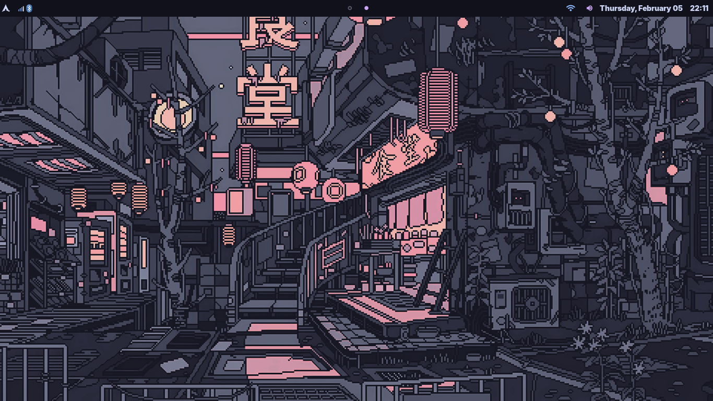
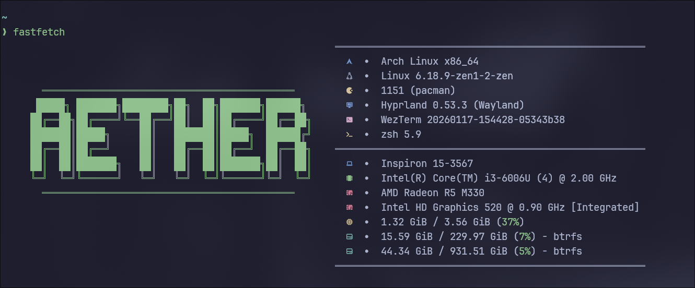
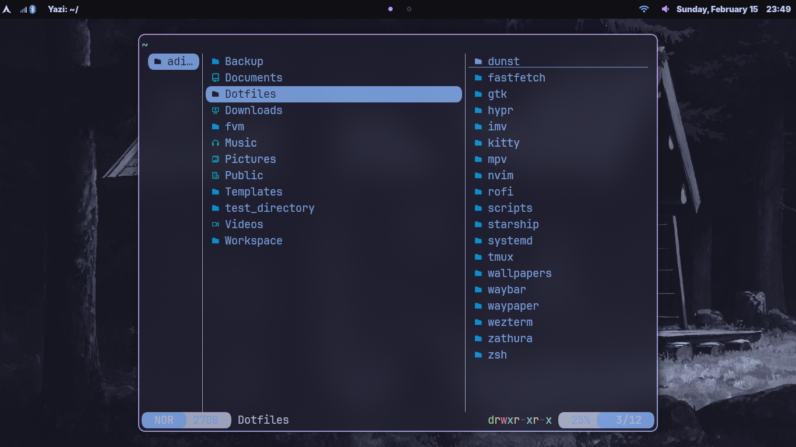

# Aether-Dotfiles 🚀

<div align="center">


**Universal Arch Linux installer with integrated dotfiles management**
*Built by a CS student, optimized for productivity and low-resource systems*

[Features](#-features) • [Installation](#-installation) • [Keybindings](#%EF%B8%8F-keybindings) • [Customization](#-customization) • [Credits](#-credits)

</div>

---

## 📖 Table of Contents

- [Philosophy](#-philosophy)
- [Features](#-features)
- [Screenshots](#-screenshots)
- [Installation](#-installation)
  - [Method 1: Fresh Arch Installation](#method-1-fresh-arch-installation-recommended)
  - [Method 2: Existing Arch System](#method-2-existing-arch-system)
  - [Method 3: Just Dotfiles](#method-3-just-dotfiles-no-system-install)
- [What's Included](#-whats-included)
- [Keybindings](#%EF%B8%8F-keybindings)
- [Custom Scripts](#-custom-workflow-scripts)
- [Customization](#-customization)
- [Hardware Optimizations](#-hardware-optimizations)
- [Dotfiles Management](#-dotfiles-management-with-stow)
- [Troubleshooting](#-troubleshooting)
- [Credits](#-credits)
- [License](#-license)

---

## 🎯 Philosophy

This configuration is designed for students and developers who:
- Need a **productive environment** for work
- Works on **limited hardware**
- Want **reproducible setups** across multiple machines
- Value **performance over eye candy** (but still want it to look good)
- Prefer **keyboard-driven workflows**
- Need **version-controlled configurations**

### Why This Setup?

- **One-command installation**: From Arch ISO to complete desktop
- **Interactive installer**: Choose encryption, LVM, disk layout
- **Minimal resource usage**: Runs smoothly on 4GB RAM
- **Workflow automation**: multiple scripts
- **GNU Stow management**: Clean, modular dotfiles structure
- **Hardware optimized**: Tuned for Intel i3-6006U + AMD Radeon M330

---

## ✨ Features

### 🔧 Universal Installer
- **Interactive installation wizard** with toggle options
- **Flexible partitioning**: Single/dual disk, LVM, encryption support
- **Hardware detection**: Automatically detects and configures GPU, CPU
- **Dual-boot friendly**: GRUB configuration for Windows/Linux
- **Post-install automation**: One script to deploy everything

### 🎨 Desktop Environment
- **Hyprland**: Modern Wayland compositor with smooth animations
- **Waybar**: Customizable status bar with system stats
- **Rofi**: Fast application launcher
- **Dunst**: Minimal notification daemon
- **Catppuccin Mocha**: Beautiful, battery-friendly color scheme

### 🛠️ Developer Tools
- **Neovim + VS Code**: Full-featured editors
- **Wezterm**: GPU-accelerated terminal
- **Zsh + Starship**: Beautiful, fast shell with git integration
- **Modern CLI tools**: eza, bat, ripgrep, fzf, zoxide, just
- **Docker support**: Containerized development
- **Git integration**: GitHub CLI, git-lfs

### 📦 Optional Components
- **Anaconda**: Full ML/AI stack
- **Communication**: Discord, Telegram
- **Media**: Spotify, MPV, VLC
- **Browsers**: Firefox, Google-Chrome

## 📸 Screenshots
## 📸 Screenshots

### Desktop

*Hyprland desktop with Waybar and Catppuccin Mocha theme*

### Terminal

*Wezterm terminal with Zsh, Starship prompt, and modern CLI tools*

### Application Launcher

*Rofi application launcher*

### File Manager

*File management with yazi*
---

## 🚀 Installation

### Method 1: Fresh Arch Installation (Recommended)

Perfect for clean installs. This will **format your disk** and install Arch from scratch.

#### Step 1: Boot Arch ISO

1. Download [Arch Linux ISO](https://archlinux.org/download/)
2. Create bootable USB with `dd` or Rufus/Etcher
3. Boot from USB (UEFI mode required)

#### Step 2: Connect to Internet

```bash
# For WiFi
iwctl
[iwd]# device list
[iwd]# station wlan0 scan
[iwd]# station wlan0 get-networks
[iwd]# station wlan0 connect "SSID"
[iwd]# exit

# For Ethernet (usually automatic)
ping archlinux.org
```

#### Step 3: Run Universal Installer (Coming Soon)

The installer will prompt you for:

| Option | Description | Recommendation |
|--------|-------------|----------------|
| **Hostname** | Computer name | `archie-laptop` |
| **Username** | Your username | Your name |
| **Passwords** | User & root passwords | Strong passwords |
| **Timezone** | Your timezone | `Asia/Kolkata` (for India) |
| **Locale** | Language/region | `en_US.UTF-8` |
| **Encryption** | LUKS disk encryption | **Yes** (recommended) |
| **LVM** | Logical Volume Manager | **Yes** (flexible) |
| **Separate Home** | Dedicated /home partition | No (unless dual disk) |
| **Dual Boot** | Windows/Linux setup | If needed |

### Method 2: Existing Arch System

Already have Arch installed? Just deploy dotfiles and applications.
```bash
# Clone repository
git clone https://github.com/adityamoghaa/aetherland.git ~/.dotfiles

# Navigate to dotfiles
cd ~/.dotfiles

# Run setup script
chmod +x setup.sh
./setup.sh
```

The setup script will:
- ✅ Install AUR helper (paru)
- ✅ Prompt for each component (Hyprland, dev Tools etc.)
- ✅ Backup existing configs
- ✅ Deploy dotfiles with GNU Stow
- ✅ Configure system optimizations

**Logout and login** for changes to take effect.

---

### Method 3: Just Dotfiles (No System Install)

Only want the configuration files? Manual deployment:
```bash
# Clone repository
git clone https://github.com/adityamoghaa/aetherland.git ~/.dotfiles
cd ~/.dotfiles

# Install GNU Stow
sudo pacman -S stow

# Backup existing configs
mkdir -p ~/.config-backup
mv ~/.config/hypr ~/.config-backup/ 2>/dev/null
mv ~/.config/waybar ~/.config-backup/ 2>/dev/null
mv ~/.zshrc ~/.config-backup/ 2>/dev/null

# Deploy dotfiles
stow *

# Verify
ls -la ~/.config/hypr  # Should show symlink
```

---

## 📦 What's Included

### Core System

| Component | Description |
|-----------|-------------|
| **Hyprland** | Dynamic tiling Wayland compositor |
| **Waybar** | Status bar with modules |
| **Rofi** | Application launcher |
| **Dunst** | Notification daemon |
| **Polkit** | Authentication agent |

### Terminal Environment

| Tool | Purpose |
|------|---------|
| **Wezterm** | GPU-accelerated terminal |
| **Zsh** | Feature-rich shell |
| **Starship** | Cross-shell prompt |
| **eza** | Modern `ls` replacement |
| **bat** | `cat` with syntax highlighting |
| **ripgrep** | Fast search tool |
| **fzf** | Fuzzy finder |
| **zoxide** | Smart directory jumper |

### Development

| Tool | Purpose |
|------|---------|
| **Neovim** | Modal text editor |
| **VS Code** | Full IDE |
| **Docker** | Containerization |
| **Git** | Version control |
| **GitHub CLI** | GitHub integration |

### Optional (Prompted During Setup)

| Category | Tools |
|----------|-------|
| **ML/AI** | Anaconda, Python, pip |
| **Communication** | Discord, Telegram |
| **Media** | Spotify, MPV, VLC |
| **Browsers** | Firefox, Google-Chrome |

---

## ⌨️ Keybindings

### Window Management

| Keybinding | Action |
|------------|--------|
| `Super + Return` | Open terminal |
| `Super + Q` | Close window |
| `Super + F` | Toggle fullscreen |
| `Super + Space` | Toggle floating |
| `Super + J/K/L/H` | Move focus (Vim-like) |
| `Super + Shift + J/K/L/H` | Move window |
| `Super + Ctrl + J/K/L/H` | Resize window |
| `Super + Mouse` | Move/resize window |

### Workspaces

| Keybinding | Action |
|------------|--------|
| `Super + 1-9` | Switch to workspace 1-9 |
| `Super + Shift + 1-9` | Move window to workspace |
| `Super + Mouse wheel` | Cycle workspaces |
| `Super + Tab` | Next workspace |
| `Super + Shift + Tab` | Previous workspace |

### Applications

| Keybinding | Action |
|------------|--------|
| `Super + Space` | Application launcher (Rofi) |
| `Super + E` | File manager (Yazi) |
| `Super + W` | Browser (Firefox) |
| `Super + SHIFT + V` | Clipboard history |

### System

| Keybinding | Action |
|------------|--------|
| `Super + L` | Lock screen |
| `Super + X` | Power menu |
| `Super + esc` | Reload Hyprland |
| `Print` | Screenshot (full) |
| `Shift + Print` | Screenshot (selection) |

### Media

| Keybinding | Action |
|------------|--------|
| `XF86AudioPlay` | Play/Pause |
| `XF86AudioNext` | Next track |
| `XF86AudioPrev` | Previous track |
| `XF86AudioRaiseVolume` | Volume up |
| `XF86AudioLowerVolume` | Volume down |
| `XF86AudioMute` | Toggle mute |
| `XF86MonBrightnessUp` | Brightness up |
| `XF86MonBrightnessDown` | Brightness down |

---

## 🎨 Customization

### Change Color Scheme

**Waybar:**
```bash
nvim ~/.config/waybar/colors.css
# Edit @define-color variables
```

**Hyprland:**
```bash
nvim ~/.config/hypr/modules/colors.conf
# Edit colors in decoration section
```

**Wezterm:**
```bash
nvim ~/.config/wezterm/wezterm.lua
# Change theme line
```

### Modify Keybindings

```bash
nvim ~/.config/hypr/modules/keybind.conf
# Edit bind statements
# Format: bind = MODS, KEY, ACTION, PARAMS
```

### Add Custom Scripts

```bash
# Create new script
nvim ~/.local/bin/my-script

# Make executable
chmod +x ~/.local/bin/my-script

# Use it
my-script
```

### Change Terminal Font

```bash
nvim ~/.config/wezterm/wezterm.lua
# Modify font_family line
```

### Modify Waybar Modules

```bash
nvim ~/.config/waybar/config
# Add/remove modules in modules-left/center/right
```

---

## 💻 Hardware Optimizations

### For Low RAM Systems
**Included optimizations:**
- TLP power management
- Swappiness reduced to 10
- Lightweight applications prioritized
- Minimal background services
- Efficient compositor settings

**Manual tweaks:**
```bash
# Check current swappiness
cat /proc/sys/vm/swappiness

# Adjust if needed
echo "vm.swappiness=5" | sudo tee -a /etc/sysctl.d/99-swappiness.conf
```

### For GPU

**Auto-configured during setup:**
- AMDGPU driver (modern open-source)
- Vulkan support
- Power-efficient settings

**Manual verification:**
```bash
# Check GPU driver
lspci -k | grep -A 3 -i "VGA"

# Test Vulkan
vulkaninfo | grep -i "device name"
```

### For Processor

**Optimizations:**
- Intel microcode updates
- CPU governor: powersave
- Turbo boost management
- Thermal throttling prevention

**Check CPU governor:**
```bash
cat /sys/devices/system/cpu/cpu*/cpufreq/scaling_governor
```

### Battery Life Improvements

```bash
# Enable TLP (already done in setup)
sudo systemctl enable --now tlp

# Check battery stats
sudo tlp-stat -b

# Laptop mode
sudo systemctl enable --now laptop-mode
```

---

## 📁 Dotfiles Management with Stow

This repository uses [GNU Stow](https://www.gnu.org/software/stow/) for symlink management.

### Structure

```
~/.dotfiles/
├── hypr/               # Hyprland package
│   └── .config/
│       └── hyprland/
├── waybar/             # Waybar package
│   └── .config/
│       └── waybar/
├── wezterm/              # Wezterm package
│   └── .config/
│       └── wezterm/
├── nvim/               # Neovim package
│   └── .config/
│       └── nvim/
├── zsh/                # Zsh package
│   ├── .zshrc
│   └── .zshenv
└── scripts/            # Custom scripts
    └── .local/
        └── bin/
```

### Stow Commands

```bash
# Deploy package
stow package-name

# Remove package
stow -D package-name

# Re-deploy (update symlinks)
stow -R package-name

# Deploy all packages
stow */

# Dry run (see what would happen)
stow --no -v package-name
```

### Adding New Configs

```bash
cd ~/.dotfiles

# Create package structure
mkdir -p alacritty/.config/alacritty

# Add config
cp ~/.config/alacritty/alacritty.yml alacritty/.config/alacritty/

# Stow it
stow alacritty
'''

---

## 🔧 Troubleshooting

### Hyprland won't start

```bash
# Check logs
cat ~/.local/share/hyprland/hyprland.log

# Test Hyprland
Hyprland

# If crashes, try from TTY
Ctrl + Alt + F2
hyprland
```

### No internet after installation

```bash
# Check NetworkManager
sudo systemctl status NetworkManager

# Enable if needed
sudo systemctl enable --now NetworkManager

# Connect to WiFi
nmtui
```

### Symlinks not working

```bash
# Verify structure
cd ~/.dotfiles
tree -L 3

# Re-stow everything
stow -R */

# Check symlinks
ls -la ~/.config/
```

### Audio not working

```bash
# Check PipeWire status
systemctl --user status pipewire pipewire-pulse

# Restart audio
systemctl --user restart pipewire pipewire-pulse wireplumber

# Check volume
pamixer --get-volume
```

### GPU acceleration not working

```bash
# Check driver
glxinfo | grep "OpenGL renderer"

# For AMD
lspci -k | grep -A 3 -i "VGA"

# Rebuild initramfs
sudo mkinitcpio -P
```

### Screen tearing

```bash
# Edit Hyprland config
nvim ~/.config/hyprland/hyprland.conf

# Add/ensure:
# general {
#     allow_tearing = true
# }
```

### High CPU usage

```bash
# Check processes
btop

# Disable animations
nvim ~/.config/hyprland/hyprland.conf
# Set animations:enabled = false
```

### Installation fails

```bash
# Check install log
cat ~/install.log

# Verify internet
ping archlinux.org

# Update keyring
sudo pacman -Sy archlinux-keyring
```

---

## 🙏 Credits & Inspiration

This configuration was inspired by these excellent dotfiles:

- **[ericmurphyxyz/dotfiles](https://github.com/ericmurphyxyz/dotfiles)** - Minimalist approach
- **[prasanthrangan/hyprdots](https://github.com/prasanthrangan/hyprdots)** - Beautiful Hyprland setup
- **[JaKooLit/Hyprland-Dots](https://github.com/JaKooLit/Hyprland-Dots)** - Comprehensive configs
- **[mylinuxforwork/dotfiles](https://github.com/mylinuxforwork/dotfiles)** - ML-series inspiration
- **[dreamsofautonomy/arch-from-scratch](https://github.com/dreamsofautonomy/arch-from-scratch)** - Installation methodology

### Special Thanks

- **Hyprland team** - Amazing Wayland compositor
- **Arch Linux community** - Best documentation
- **r/unixporn** - Endless inspiration

---

## 📊 System Information

**Tested on:**
- Dell Inspiron 15 5000 Series
- Intel Core i3-6006U @ 2.00GHz
- AMD Radeon R5 M330 (2GB)
- 4GB DDR3 RAM
- 256GB SSD + 1TB HDD

**Compatibility:**
- Any x86_64 system with UEFI
- 2GB+ RAM (4GB+ recommended)
- 20GB+ storage
- Intel/AMD/NVIDIA graphics

---

## 📝 To-Do

- [ ] Add more color scheme options
- [ ] Create installation video tutorial
- [ ] Add fully script-based installation
- [ ] Improve power management scripts
- [ ] Add automatic backup script
- [ ] Create GUI configuration tool

---

## 🤝 Contributing
Contributions are welcome! If you have improvements:

## 📄 License
This project is licensed under the MIT License - see the [LICENSE](LICENSE) file for details.

**TL;DR:** You can use, modify, and distribute this freely. Credit appreciated but not required.

---

## ⭐ Star History

If this project helped you, consider giving it a star! ⭐

[](https://star-history.com/#adityamoghaa/aetherland&Date)

---

<div align="center">

**Made with ❤️ by a CS student who loves tinkering**
*Optimized for productivity • Designed for students • Built for low-spec systems*

[⬆ Back to Top](#aether-dotfiles-)

</div>
